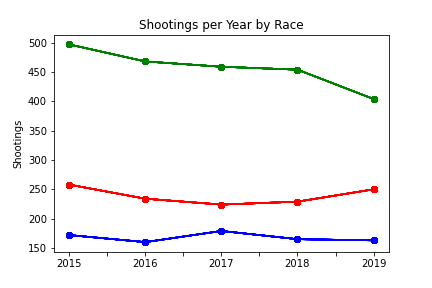

# US Police Shootings

Police shootings have been a hot topic recently in the US. I wanted to take a closer look at the data to gain a better understanding of why these shootings were occurring, if they were justified, and if any correlations existed. 

## Are Police Shootings Increasing?

The first question I asked myself was, are police shootings increasing? Based on what I have heard recently on the news, I expected them to be increasing. My dataset ranged from 2015 to the first half of 2020. I decided to graph the total number of police shootings by year. I also excluded 2020 so the data would not be skewed.

As you can see my assumption was incorrect. Thats great news! Police shootings have been trending down over the past 4 years with 2019 being the fewest to date with a total of 858.

## Does Race Matter?

Throughout the history of the US, racism has been a hot topic which has recently been in the news involving police interactions. The data frame contained 6 different races, White, Black, Hispanic, Asian, Native, and Other. I decided to break the data frame into groups depending on race to see what correlations exist.

## Which race is involved in the majority of police shootings? 

As you can see, white Americans are involved in police shootings. This was expected as the majority of Americans identify as white. This led me to take a closer look at the ratios of each group.

## Comparing Race Ratios

I collected data from the US Census Bureau to get the percentage of each race in America. (Sorry about the pie chart)

I compared the percentage of population by race to the information I had in my data. 

As you can see, the number that sticks out is the Black American population. Although they make up just over 13% of the US population, Black Americans are involved in over 26% of Police shootings.

## Comparing Trends

Knowing that the overall number of police shootings were decreasing each year, I was curious to see how each race was trending. 

-White Americans are trending similar to the overall trend of police shootings. 
-Hispanic Americans are trending down since having a spike in 2017
-Black Americans have been trending up since having a low point in 2017

## What happened in 2017??

I would love to be able to answer this question but because of the lack of data and the amount of variables that could go into answering this question, it is not possible. However, there are a few events in 2017 that I can think of that may have something to do with the the trends in 2017. But I will only focus on the data at hand.

## Comparing States

I decided to look at each state to see if I could find anything interesting.

This map shows the total number of police shootings by state. California had nearly twice as many police shootings as the next closes state with 701. Texas 426 and Florida 324 round out the top three states with the most police shootings.

Wanting to compare the total number of shootings to the Black American community, I used the same graph.

As you can see, the two graphs correlate closely with one another. Both graphs correlate with population. The states with higher overall population, regardless of race, see more police shootings. 

This did not help me to understand the current trend of Black Americans being involved in police shootings.

##  Ratio of Shootings by State

I wanted to look at the same graph but looking at the ratio of shootings involving Black Americans. To calculate the ratio I divided the total number of shootings involving Black Americans by the total amount of shootings of each state.

As you can see, this graph tells a much different story than the previous two. Although in the previous graphs, California, Texas, and Florida lead the way in both police shootings and police shootings involving Black Americans, This graph shows:

CA - 29th with a ratio of 17%
TX - 23rd with a ratio of 23%
FL - 16th with a ratio of 34%

Excluding Washington D.C. because of the small sample size, the top two states according to ratio:

Over half of police shootings in these states involve Black Americans…

## Looking into Louisiana

I decided to take a closer look at Louisiana because they had a larger amount of data compared to Maryland. I wanted to know why such a large percentage of police shootings involved Black Americans.

The first category I looked at was, ‘Threat Level’ , and wether the person involved was considered to be ‘Attacking’. And compared the two races that were most involved in police shootings in LA.

Black Louisianan’s were ‘Attacking’ 56% more than White Louisianan’s.

I then wanted to look at the percentage of unarmed Louisianan’s by race.

Black Louisianas were shot while unarmed 8% of the time compared to White Louisianan’s at 2%.

And lastly I combined the two metrics to see the percentage of people shot who were ‘Unarmed’ and not ‘Attacking’.

1% White Louisianan’s compared to 5% Black Louisianan’s were shot while  ‘Unarmed’ and not ‘Attacking’.

## Final Thoughts

Although a morbid topic, I was curious to see the data around police shootings. I feel I have gained a better understand and context of those who were shot by police. 

